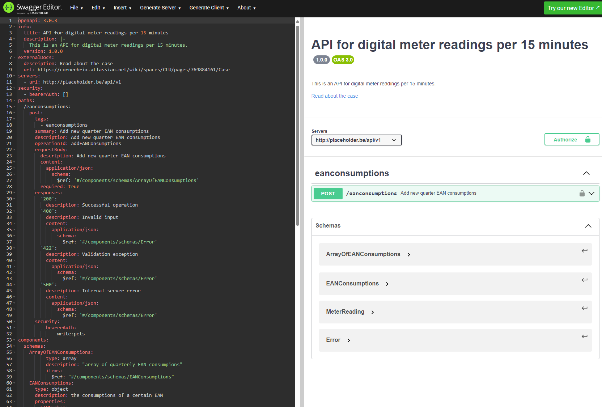
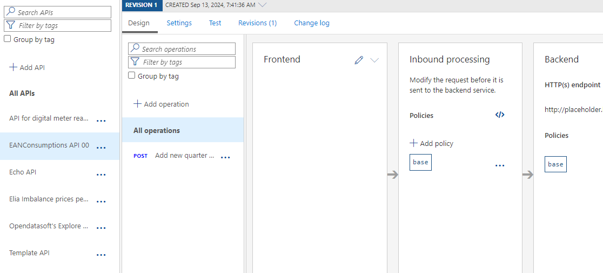

## Import API using OpenAPI

There are multiple ways to import APIs into Azure API Management. One option would be to manually add operations to an API.This approach is mostly used when there is a need to follow a design first approach. For this exercise an Open API specification is alreayd available.

### OpenAPI
First open the OpenAPI specification for the API that you want to import. The OpenAPI specification is a standard way to describe a RESTful API. It is a JSON or YAML file that contains all the information about the API, such as the endpoints, operations, request and response schemas, and more.

Navigate to the website https://editor.swagger.io and through the **File** menu, select **Import file**. Select the file [PXL_EANConsumptions_API.yaml](../../assets/openapispec/PXL_EANConsumptions_API.yaml) and click **Open**. The OpenAPI specification will be loaded into the editor.

Have a look at the different sections of the OpenAPI specification. The specification contains information about the API such as the title, version, description, and the different endpoints. The endpoints contain information about the operations that can be performed on the endpoint, such as the HTTP method, request and response schemas, and more.

### Import API

1) On the left menu, open the **APIs** blade.  
2) Click on **Add API**.  
3) Under **Create from definition** select **OpenAPI**.  
4) Select the **Full** option in the **Create from OpenAPI specification** dialog.  
5) In the **Specification URL** field, click **Select a file** and upload the [PXL_EANConsumptions_API.yaml](../../assets/openapispec/PXL_EANConsumptions_API.yaml) file.

> **Note the intentional use of `http` instead of `https` as this backend does not presently support `https`.**  

6) While the backend service only runs on `HTTP`, we need to **set URL scheme to `Both`** to allow for Azure API Management ingress to occur on HTTPS for callers such as the Developer Portal.  
7) Change the **Name** to `eanconsumptions-api-xx`. Replace xx with your student number for this excercise.
8) Set the **API URL suffix** to `api/digital-meter-readingxx`.  Replace xx with your student number for this excercise.
9) Change the **Display name** to `EANConsumptions API xx`. Replace xx with your student number for this excercise.
10) Press **Create**.  

- Once the API is created, it will show in the list of APIs along with all of its operations.

> The backend HTTP endpoint should have been set to 'http://placeholder.be/api/v1'. This is a placeholder and will be replaced with the actual backend endpoint in the next exercise.

  

## Add mock response
Since the backend service is not yet available, we will add a mock response to the API operation. This will allow us to test the API operation without having to wait for the backend service to be available.

1) Click on the **POST /ean-consumptions** operation. Display name: 'Add new quarter EAN consumptions'
2) Click on 'Add policy' in the **Inbound processing** section.
3) Select 'Mock responses' from the list of policies.
4) Leave the default value '200 OK, application/json' for 'API Management response' and click 'Save'.
5) The portal will now show the mock response policy in the **Inbound processing** section and show the banner value 'Mocking is enabled'.

---
