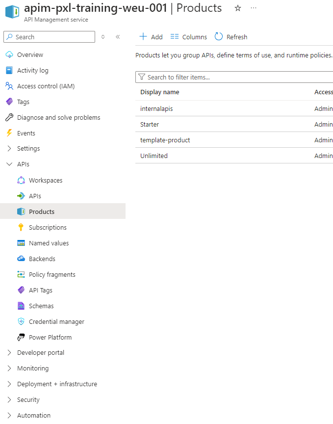
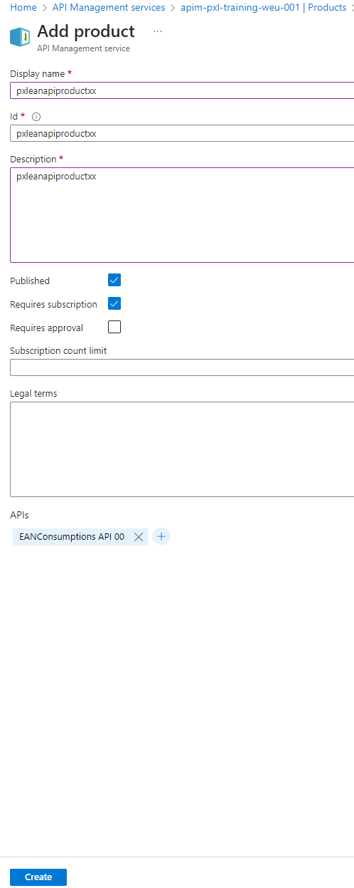
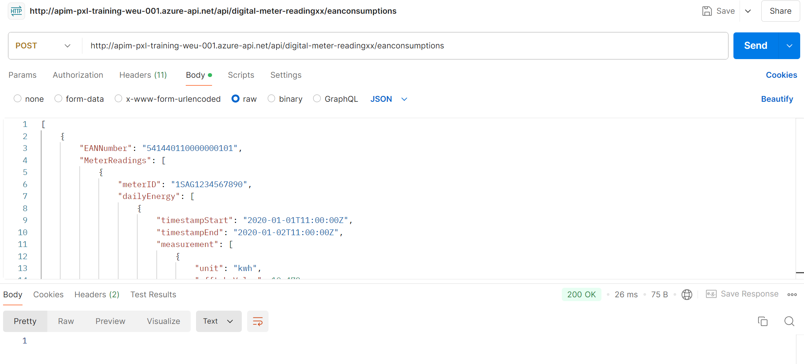

## Calling API and testing Subscription Keys
One way to secure your API is to require a subscription key. This key is used to identify the calling application and to track the usage of the API. In this exercise, we will add a subscription key to the API and test it.

The first thing we will need to do is to create a product in Azure API Management. A product is a collection of APIs that you can publish to developers. You can configure the product to require a subscription key, and you can set rate limits on the product.

### Create a product
In the Azure portal go to your API Management instance and click on **Products** in the left-hand menu. Click on **Add product**.

  

1) Fill in the details for the product.

| Field                | Value                        |
|----------------------|------------------------------|
| **Display name**     | pxleanapiproductxx              |
| **Id**               | pxleanapiproductxx              |
| **Description**      | pxleanapiproductxx  |
| **Published**        | True                         |
| **Requires subscription** | True                   |
| **Requires approval** | False                      |

Replace xx with your student number for this excercise.

2) Click on the '+' button next to **APIs** and select the **EANConsumptions API xx** API. Click on **Add**.

  

3) Click on **Create** to create the product.

### Create a subscription
Next, we will create a subscription to the product. A subscription is a relationship between a developer and a product. It contains the subscription key that the developer will use to call the API.

1) Go to **Products** in the left-hand menu and click on the product you created.
2) Click on **Subscriptions** in the left-hand menu and then click on **+ Add subscription**.
3) Fill in the details for the subscription.
Name: pxleanapisubscriptionxx
Display name: pxleanapisubscriptionxx
Allow tracing: true (this will be used later in the exercise)
User: Leave empty


## Retrieve the subscription key
Now that we have created the subscription, we can retrieve the subscription key.

1) Click on the subscription you created.
2) Click on **...** and select **Show/hide keys** to reveal the subscription key.
3) Copy the primary key and store it locally since it will be used later on during this excercise.

## Test the API
There are multiple ways to test an API in Azure API Management. One way is to use the **Test** tab in the Azure portal. This tab allows you to test the API operation by sending a request to the API and viewing the response.

### Test the API operation inside the Azure portal
1) Click on the **Test** tab.
2) In the **Request body** section, enter the following JSON object if it's not present already:

```json
[
    {
        "EANNumber": "541440110000000101",
        "MeterReadings": [
            {
                "meterID": "1SAG1234567890",
                "dailyEnergy": [
                    {
                        "timestampStart": "2020-01-01T11:00:00Z",
                        "timestampEnd": "2020-01-02T11:00:00Z",
                        "measurement": [
                            {
                                "unit": "kwh",
                                "offtakeValue": 10.478,
                                "offtakeValidationState": "VAL",
                                "injectionValue": 8.377,
                                "injectionValidationState": "VAL"
                            }
                        ]
                    }
                ]
            }
        ]
    }
]
```
3) Click on **Send** to send the request to the API.
4) The response will be displayed in the **Response body** section. The response should be the mock response that was added to the API operation.


### Test the API operation using Postman
Another way to test the API operation is to use a tool like Postman. Postman is a popular tool for testing APIs. It allows you to send requests to an API and view the response. You can download Postman from the following link: [Postman](https://www.postman.com/downloads/).

1) Open Postman.
2) Create a new request by clicking on the **New** button.
3) Enter the request URL. The request URL is the URL of the API operation. You can find the URL in the **Request URL** section of the **Test** tab in the Azure portal.
4) Select the **POST** method.
5) Click on the **Body** tab.
6) Select **raw** and **JSON** from the dropdown menu.
7) Enter the request body in the text area. The request body is the same as the request body that was entered in the **Request body** section of the **Test** tab in the Azure portal.
8) Add a new header with the key **Ocp-Apim-Subscription-Key** and the value of the subscription key you copied earlier.
9) Click on the **Send** button to send the request to the API.
10) The response will be displayed in the **Response** section. The response should be the mock response that was added to the API operation.

