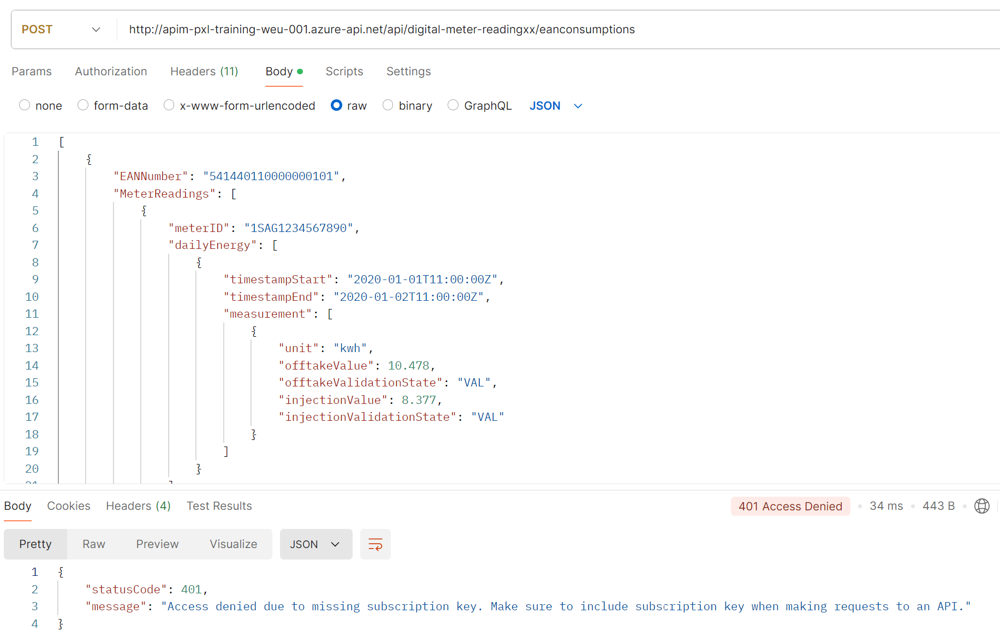

## Calling API and testing Subscription Keys
One way to secure your API is to require a subscription key. This key is used to identify the calling application and to track the usage of the API. In this exercise, we will add a subscription key to the API and test it.

The first thing we will need to do is to create a product in Azure API Management. A product is a collection of APIs that you can publish to developers. You can configure the product to require a subscription key, and you can set rate limits on the product.

### Create a product
In the Azure portal go to your API Management instance and click on **Products** in the left-hand menu. Click on **Add product**.

  

1) Fill in the details for the product.

| Field                | Value                        |
|----------------------|------------------------------|
| **Display name**     | pxleanapiproductxx              |
| **Id**               | pxleanapiproductxx              |
| **Description**      | pxleanapiproductxx  |
| **Published**        | True                         |
| **Requires subscription** | True                   |
| **Requires approval** | False                      |

Replace xx with your student number for this excercise.

2) Click on the '+' button next to **APIs** and select the **EANConsumptions API xx** API. Click on **Add**.

  

3) Click on **Create** to create the product.

### Create a subscription
Next, we will create a subscription to the product. A subscription is a relationship between a developer and a product. It contains the subscription key that the developer will use to call the API.

1) Go to **Products** in the left-hand menu and click on the product you created.
2) Click on **Subscriptions** in the left-hand menu and then click on **+ Add subscription**.
3) Fill in the details for the subscription.
Name: pxleanapisubscriptionxx
Display name: pxleanapisubscriptionxx
Allow tracing: true (this will be used later in the exercise)
User: Leave empty

## Retrieve the subscription key
Now that we have created the subscription, we can retrieve the subscription key.

1) Click on the subscription you created.
2) Click on **...** and select **Show/hide keys** to reveal the subscription key.
3) Copy the primary key and store it locally since it will be used later on during this excercise.

## Test the API with the subscription key
The first thing we will do is to test the API without the subscription key to see that it is not possible to call the API without it.

1) Go to postman and resend the request to the API without the subscription key.
2) You should get a 401 Unauthorized response.

Next, we will add the subscription key to the request and resend it.
1) Go to the Headers tab in Postman.
2) Add a new header with the key **Ocp-Apim-Subscription-Key** and the value of the subscription key you copied earlier.
3) Resend the request.
4) You should now get a 200 OK response.