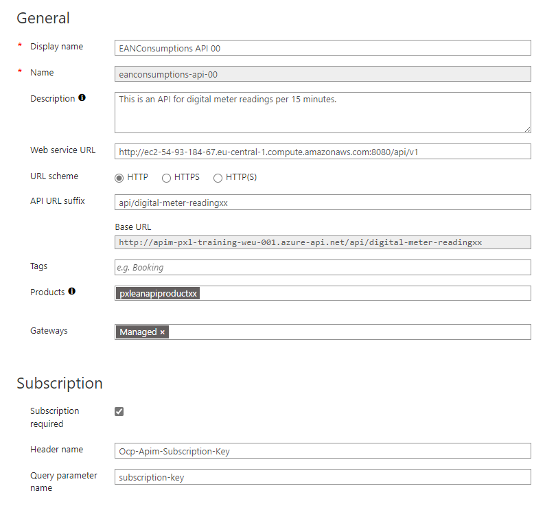
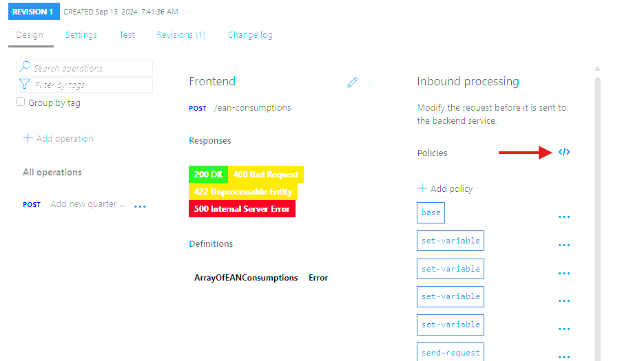

## Connect API to backend

The next step is to connect the API to the backend service. This will allow the API to forward requests to the backend service and return the response to the client.

### Remove mocking policy
1. Click on the **POST /ean-consumptions** operation.
2. Click on the **Mock responses** policy in the **Inbound processing** section.
3. The policy editor will open. Locate the following line and remove it:

```xml
    <mock-response status-code="200" content-type="application/json" />
```
4. Press **Save**.

### Connect the API to the backend service

1. In the Azure portal, go to your API Management instance and click on **APIs** in the left-hand menu.
2. Click on the **EANConsumptions API xx** API.
3. Click on the **Settings** tab.
4. Change the value of the **Backend URL** to the URL of the Camel API created during day 1. The URL should resemble `http://<your-instance-name>-.eu-central-1.compute.amazonaws.com:8080/api/v1`. Replace `<your-instance-name>` with the values from the previous exercise in Camel.
5. Press **Save**.

  

### Add backend API security
The backend API that was created during the first day should require a valid OAuth token to access the API. For this exercise, we will assume that the API requires a valid OAuth token in the `Authorization` header. We will configure Azure API Management to request a new OAuth token from the idenntity provider for each request and forward the token to the backend service in the `Authorization` header.

1. Click on the **EANConsumptions API xx** API.
2. Click on the operation **POST /ean-consumptions**.
3. Go to the **Inbound processing** section and open **policy code editor**.
 
 4. The XML editor will open. Add the following policy to the `<inbound>` section of the policy:
```xml
      <set-variable name="tokenEndpoint" value="https://login.microsoftonline.com/09385aae-477d-4c3c-bb3d-36f75a52cdc3/oauth2/v2.0/token" />
        <set-variable name="clientId" value="<replace with backend clientId>" />
        <set-variable name="clientSecret" value="replace with backend secret" />
        <set-variable name="scope" value="replcace with backend scope" />
        <!-- Call Azure Active Directory to retriev a token -->
        <send-request mode="new" response-variable-name="tokenResponse" timeout="20" ignore-error="false">
            <set-url>@((string)context.Variables["tokenEndpoint"])</set-url>
            <set-method>POST</set-method>
            <set-header name="Content-Type" exists-action="override">
                <value>application/x-www-form-urlencoded</value>
            </set-header>
            <set-body>@{
            return "client_id=" + context.Variables["clientId"] + 
                   "&scope=" + context.Variables["scope"] + 
                   "&client_secret=" + context.Variables["clientSecret"] + 
                   "&grant_type=client_credentials";
        }</set-body>
        </send-request>
        <!-- Store statuscode in context variable -->
        <set-variable name="STSResponseCode" value="@(((IResponse)context.Variables["tokenResponse"]).StatusCode)" />
        <!-- Add token to Authorization header -->
        <set-header name="Authorization" exists-action="override">
            <value>@("Bearer " + ((IResponse)context.Variables["tokenResponse"]).Body.As&lt;JObject&gt;()["access_token"])</value>
        </set-header>
 ```
 5. Replace the placeholders with the values from the backend service. Request the values from the instructor.
 6. Press **Save**.


### Test the API
In order to test the API, we will use Postman to send a request to the API and view the response.

1. Open Postman.
2. Create a new request.
3. Set the request type to **POST**.
4. Enter the URL of the API. The URL should resemble `https://<your-apim-instance-name>.azure-api.net/ean-consumptions`.
5. Go to the **Headers** tab and add a new header with the key `Ocp-Apim-Subscription-Key` and the value of the subscription key you copied earlier.
6. Go to the **Body** tab and enter the following JSON object:

```json
[
    {
        "eanNumber": "541440110000000101",
        "meterReadings": [
            {
                "meterId": "1SAG1234567890",
                "dailyEnergy": [
                    {
                        "timestampStart": "2020-01-01T11:00:00Z",
                        "timestampEnd": "2020-01-02T11:00:00Z",
                        "offtakeValue": "10.478",
                        "offtakeValidationState": "VAL",
                        "injectionValue": "8.377",
                        "injectionValidationState": "VAL"
                    }
                ]
            }
        ]
    }
]
```
7. Send the request.
8. You should receive a response with a status code of 200 OK and a JSON object containing the response from the backend service.
