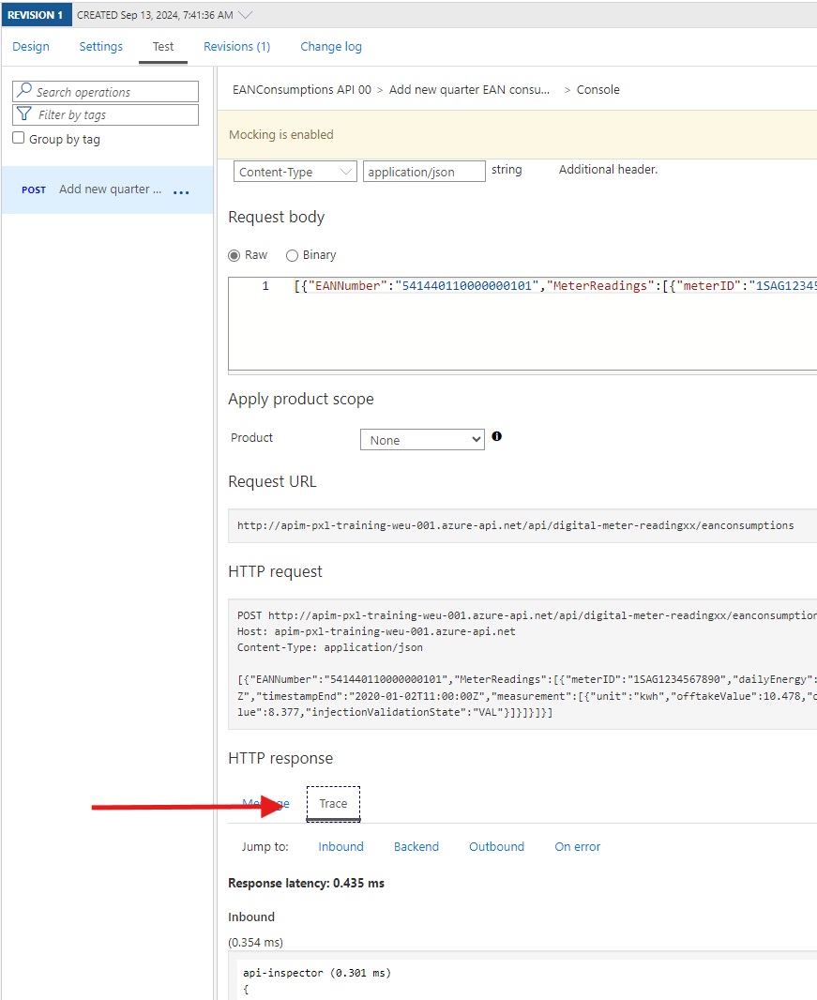
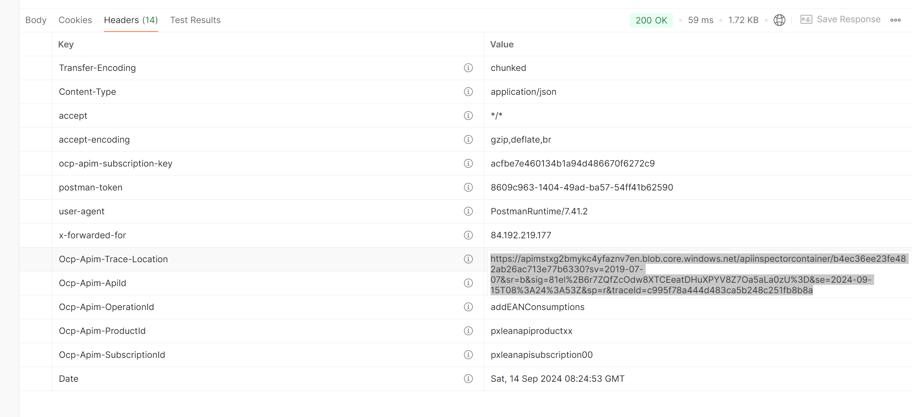

### Debug API in Azure API Management
In this exercise, we will debug an API in Azure API Management. Debugging an API is an important part of the development process as it allows you to identify and fix issues in your API implementation.

#### Prerequisites
- Completed the previous exercises in this module.

#### Exercise 1: API tracing through the portal
In this exercise, we will debug an API operation in Azure API Management. We will use the **Trace** feature in the Azure portal to view the request and response details for the API operation.

1. In the Azure portal, go to your API Management instance and click on **APIs** in the left-hand menu.
2. Click on the **EANConsumptions API xx** API.
3. Click on the **Operations** tab.
4. Click on the **POST /ean-consumptions** operation.
5. Enter a valid JSON object in the **Request body** section. It should be present already. In case it's missing  reuse the value used during the previous exercises.
6. Click on **Trace** to send the request with tracing enabled.
7. The "HTTP response" should display a 200 OK response.
8. Click on the **Trace** tab to view the request and response details.

  

9. The trace will show the request and response details, including the request headers, request body and response headers.

### Excercise 2: API tracing through Postman
In this exercise, we will debug an API operation in Azure API Management using Postman. We will use Postman to send a request to the API operation and view the response.

#### Enalbe tracing for your subscription
1. In the Azure portal, go to your API Management instance and click on **Subscriptions** in the left-hand menu.
2. Click on the subscription you created earlier.
3. Set the **Allow tracing** option to **true**.

#### Test the API operation using Postman
1. Open Postman.
2. Create a new request.
3. Set the request type to **POST**.
4. Enter the URL of the API operation. The URL should resemble `https://<your-apim-instance-name>.azure-api.net/ean-consumptions`.
5. Go to the **Headers** tab and add a new header with the key `Ocp-Apim-Subscription-Key` and the value of the subscription key you copied earlier.
6. Add a new header with the key `Ocp-Apim-Trace` and the value of `true`.
7. Go to the **Body** tab and enter the following JSON object:

```json
[
    {
        "EANNumber": "541440110000000101",
        "MeterReadings": [
            {
                "meterID": "1SAG1234567890",
                "dailyEnergy": [
                    {
                        "timestampStart": "2020-01-01T11:00:00Z",
                        "timestampEnd": "2020-01-02T11:00:00Z",
                        "measurement": [
                            {
                                "unit": "kwh",
                                "offtakeValue": 10.478,
                                "offtakeValidationState": "VAL",
                                "injectionValue": 8.377,
                                "injectionValidationState": "VAL"
                            }
                        ]
                    }
                ]
            }
        ]
    }
]
```
8. Send the request.
9. You should receive a response with a status code of 200 OK and a JSON object containing the response from the backend service.
10. Inside the response headers, you should see the `ocp-apim-trace-location` header. Copy the value of this header and open it in your browser window.
 
11. Inspect the trace details in the browser window.